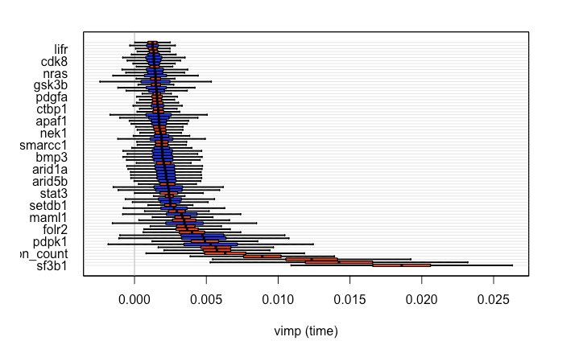

# Predicting Survival of Breast Cancer Patients Who Received Hormone and/or Radiation Therapy Incoporating High-dimensional Gene Expression Information

# Importance 

Accurate estimation of prognosis is essential for clinical decision making and care for breast cancer patients. Patients with same clinical characteristics (e.g., tumor stage) can respond to treatments differently and experience different survival outcomes, which might be attributable to complex variation in individual gene expression. Hormone and radiation therapy are common treatments for breast cancer and there are many patients who receive both. Recent studies raised the concern that hormonal therapy may reduce the efficacy of radiation (Cecchini et al., 2015), and it is not clear whether accurate estimation of survival can be achieved depending on patient treatment assignments.

# Project goal

The goal of the current analysis is to create predictors for survival among patients who received only hormone, only radiation, or both hormone and radiation therapy.

# Study design

The data is from the Molecular Taxonomy of Breast Cancer International Consortium (METABRIC) database and accessed from Kaggle (clink for link). The prospective data consists of 31 clinical features and 506 genetic attributes collected from almost 2000 breast cancer patients. These patients were followed up and the time (months) to either censoring or death were collected. A part of the genetic attributes are numeric z-scores representing the number of standard deviations in mRNA expression from the mean expression in a reference population, which measures whether a gene is increased or decreased relative to tumor-free people or patients of other tumors. The rest of the genetic features are binary indicators of mutation, which is very sparse. The clinical attributes include 31 features such as cancer stage, treatment, tumor size, etc. The structure of the data lead me to conduct a survival analysis. I also decided to drop the mutation features in the data for they are too sparse. One of the clinical variable summarized the number of mutations of each patient, so I felt this is a good enough representation of the mutation data.

# Algorithms

Because I have time-to-event data, the algorithms that I used are the Cox proportional hazard regression, Cox proportional hazard regression with regularization (lasso, ridge, alpha=0.5), and random survival forest. I choose the C-index as my loss function for its good interpretability like AUROC. For the regularized cox models, I used cross-validation to tune the lambda value and use the lambda value that gives minimum mean cross-validated error. For the random survival forest model, I use the parameters that were suggested by Pickett and colleagues (2021).

# Results

Based on the results, ridge predictor had the best performance in the predictor for patients who had hormone and radiation therapy. Lasso predictor had the best performance in the predictors for patients who only had hormone therapy. Random survival forest had the best performance for the predictor for patients who only had radiation therapy and overall patients. The overall performance is not that great, which might related to the fact that there are too many features vs. relatively small patients number. The performance using regularized regression and random survival forest are also close to each other. They all outperform the traditional cox proportional regression.

### Feature importance plot of the random survival forest predictor among all patients

# Conclusion

To summarize, I created predictors for survival among breast cancer patients who received different combos of hormone and radiation therapy. Because of the high dimension of the data that involves hundreds of gene expression features, I prioritize the predictive ability over interpretability (e.g., risk factors). The performance of these predictors are averagely in the range of 0.65-0.7, which is not excellent. However, the regularized cox hazard proportional models and the random survival forest all outperformed the traditional Cox proportional model by a lot, indicating of the potential of more accurate predictors with more observations. A major limitation of the study is the small number of observations relative to the number of features. Another limitation is that the time-to-event measurement do not start from a coherent time point (e.g., time of diagnosis of breast cancer), which makes it harder to interpret the results in terms of how to apply it to practice. 

Because of limited data, this initial development needs further implementation steps to improve accuracy and reliability. One of the steps is to make sure that new clinical, mRNA and mutation data are measured in a standard way compared to the current data collection plan. As new patient data increase, it is ideal to expand this to patients who receive other types of treatment and combos (e.g., chemotherapy). We also need to constantly monitor the patterns of key features, missing values, and predictive performance over time. Specifically, tumor stage is a feature that has a lot of missing values. Further steps should be taken to examine why this information is missing and how to improve. For the purpose of the predictors are to assist clinical decision making, I expect the audience to be practitioners in clinical settings or patients themselves. So, I think visualizing patients estimation of survival probability over time like I did would be useful. 
